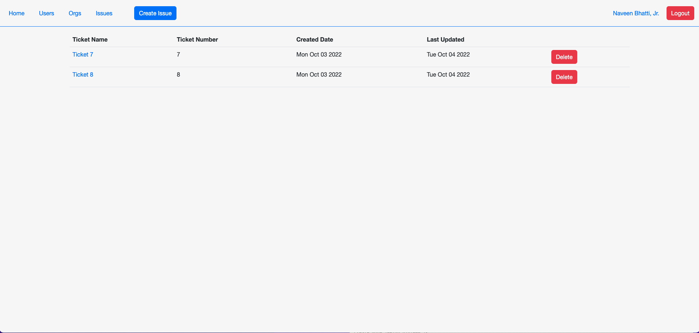

# Service Ticket Tracker
Service Ticket Tracker is an app built to contain and interact with service desk tickets. The idea for this program was inspired by my past job as a Service Desk Support Specialist. The idea of managing tickets seemed to be the best application of my past working knowledge and my newly attained skills in CRUD.
## Getting Started
### Deployed App
This app is deployed using fly.io and can be used [here](https://service-ticket-tracker-ultra.fly.dev/)
### Planning Materials/Trello Board
The planning materials can be found on the Trello board linked [here](https://trello.com/invite/b/mMrSKfqC/99eaa59737a54b003651ffb64d5d1a4f/service-ticket-tracker). This board includes the user stories, ERD, and wireframes for the project.
### Navigation
The application is quite simple. Most of the functions require a user to be signed into the application, similar to an enterprise service desk system.
- Home: The home page will either display a "Please Sign in Page" or a personalized user page based on the login status of the user
- Users: Clicking the "Users" tab in the navigation will lead to a list of all the users registered in the application. From this view, a standard user can click on an individual user profile to see additional information on the user or click the gear icon to be presented with an admin login page (Button leads directly to admin settings if the signed-in user is already an admin)
- Orgs: Similar to the Users tab, the org page shows a list of organizations within the company. Admins will be able to add orgs from this view. All users will be able to enter into an org and see the members (Admins can also add users in the same view)
- Issues: The issues page will present the user with all the tickets owned by themselves, or if the user is an admin, they will be presented all the tickets across the company.
- Create Issue: The create issue button will allow the logged-in user to create a ticket.
## Screenshots
Included in this section are a few screenshots of the application.
### Home Page for logged-in User

### Issues Page for Tickets

## Technologies Used
- Programming Languages - Javascript, HTML, and CSS
- Database - MongoDB (using Mongoose for interaction)
- Frameworks - Express.js and Node.js
## Next Steps
In future versions of the app, I would like to add a few icebox features shown below.
- Add the ability to elevate/escalate tasks from the user view
- Create a timer based on the wait time of the user (SLA Timer)
- Add updates to tickets that have not been seen by the user to the homepage of the logged-in user
- Add the ability to add additional viewers to tickets